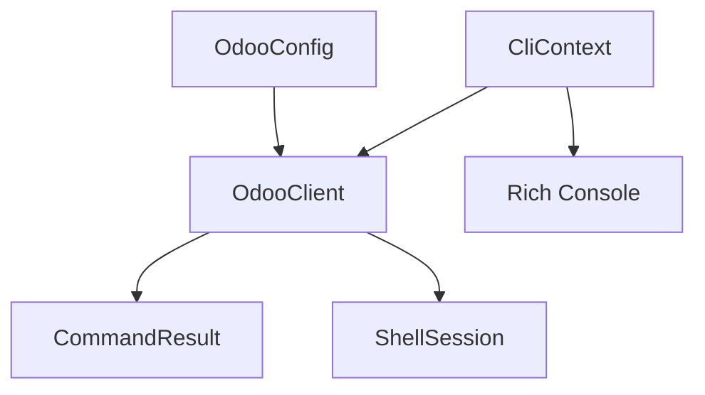

# Data Model Specification

## Core Entities

### OdooConfig
**Purpose**: Store connection and authentication details for Odoo instance

**Fields**:
| Field | Type | Required | Description | Validation |
|-------|------|----------|-------------|------------|
| url | str | Yes | Odoo instance URL | Must be valid URL with http/https |
| database | str | Yes | Database name | Non-empty string |
| username | str | Yes | Login username | Valid email or login |
| password | str | Yes | Authentication password | Non-empty (security: never log) |

**Source Priority**:
1. Environment variables (ODOO_URL, ODOO_DB, ODOO_USERNAME, ODOO_PASSWORD)
2. .env file in current directory
3. ~/.odoo_config fallback

**Example**:
```python
@dataclass
class OdooConfig:
    url: str
    database: str
    username: str
    password: str

    @classmethod
    def from_env(cls) -> 'OdooConfig':
        """Load from environment with fallbacks."""
        pass

    def validate(self) -> None:
        """Validate configuration completeness."""
        if not all([self.url, self.database, self.username, self.password]):
            raise ValueError("Incomplete configuration")
```

### OdooClient
**Purpose**: XML-RPC client for Odoo operations (bundled from MCP)

**Fields**:
| Field | Type | Required | Description |
|-------|------|----------|-------------|
| config | OdooConfig | Yes | Connection configuration |
| uid | int | No | User ID after authentication |
| models | xmlrpc.client.ServerProxy | No | Models endpoint proxy |
| common | xmlrpc.client.ServerProxy | No | Common endpoint proxy |

**Methods**:
- `authenticate()` - Login and get uid
- `execute(model, method, *args, **kwargs)` - Generic method execution
- `search(model, domain, limit, offset)` - Search records
- `read(model, ids, fields)` - Read specific records
- `search_read(model, domain, fields, limit, offset)` - Combined search+read

### CommandResult
**Purpose**: Standardized output for all CLI commands

**Fields**:
| Field | Type | Required | Description | JSON Mode |
|-------|------|----------|-------------|-----------|
| success | bool | Yes | Operation success status | Always included |
| data | Any | No | Result data (records, fields, etc) | Included if success=true |
| error | str | No | Error message | Included if success=false |
| error_type | str | No | Error category | connection/auth/data |
| count | int | No | Record count for searches | Optional metadata |
| truncated | bool | No | If results were limited | For large datasets |

**JSON Output**:
```json
{
  "success": true,
  "data": [...],
  "count": 150,
  "truncated": false
}
```

**Error Output**:
```json
{
  "success": false,
  "error": "Authentication failed",
  "error_type": "auth",
  "suggestion": "Check username and password"
}
```

### ShellSession
**Purpose**: Interactive shell state management

**Fields**:
| Field | Type | Required | Description |
|-------|------|----------|-------------|
| client | OdooClient | Yes | Active Odoo connection |
| history | List[str] | Yes | Command history |
| namespace | Dict | Yes | Available variables/functions |
| histfile | str | Yes | Path to history file |

**Pre-loaded Namespace**:
```python
namespace = {
    'client': OdooClient,           # Main client instance
    'json': json,                   # JSON utilities
    'pprint': pprint.pprint,        # Pretty printing
    'datetime': datetime,           # Date handling
    'search': client.search,        # Convenience shortcuts
    'read': client.read,
    'execute': client.execute,
}
```

### CliContext
**Purpose**: Shared state across Click commands

**Fields**:
| Field | Type | Required | Description |
|-------|------|----------|-------------|
| client | OdooClient | No | Lazy-loaded client |
| json_mode | bool | Yes | Global JSON output flag |
| console | Console | Yes | Rich console instance |

**Usage**:
```python
@click.pass_context
def cli(ctx, json):
    ctx.obj = CliContext(json_mode=json)
```

## Relationships



## State Transitions

### Client Connection States
```
UNINITIALIZED -> CONFIGURED -> AUTHENTICATED -> READY
                     |              |
                     v              v
                  CONFIG_ERROR   AUTH_ERROR
```

### Command Execution Flow
```
PARSE_ARGS -> LOAD_CONFIG -> CONNECT -> EXECUTE -> FORMAT_OUTPUT
                 |             |          |
                 v             v          v
            CONFIG_ERROR  CONN_ERROR  DATA_ERROR
```

## Data Validation Rules

### Configuration Validation
- URL must start with http:// or https://
- Database name must be alphanumeric with underscores
- Username should be email or alphanumeric
- Password minimum 4 characters (warn if less)

### Search Domain Validation
- Must be valid Python list representation
- Tuples must have 3 elements (field, operator, value)
- Support special operators: =, !=, >, <, >=, <=, like, ilike, in, not in

### Field Names Validation
- Comma-separated list of valid Python identifiers
- Support dot notation for related fields (e.g., partner_id.name)

### JSON Argument Validation
- Must be valid JSON string
- Automatically parse before sending to XML-RPC
- Clear error messages for malformed JSON

## Performance Considerations

### Batch Size Limits
- Default search limit: 20 records
- Warning threshold: 500 records
- Maximum without override: 10000 records

### Connection Pooling
- Reuse XML-RPC connections within same command
- Lazy connection (connect only when needed)
- Timeout: 30 seconds for XML-RPC calls

### Memory Management
- Stream large results instead of loading all
- Use generators for paginated searches
- Clear result sets after output

## Security Considerations

### Credential Handling
- Never log passwords in any output
- Mask passwords in error messages
- Support environment variables for CI/CD
- Document .env file permissions (chmod 600)

### XML-RPC Security
- Always use authenticated endpoints
- Validate SSL certificates (configurable)
- Support proxy configuration if needed

---

## Implementation Notes

1. **Entity Classes**: Use Python dataclasses for clean structure
2. **Validation**: Implement in model classes, not in commands
3. **Serialization**: All entities must be JSON-serializable
4. **Error Handling**: Consistent error types across all operations
5. **Testing**: Mock entities for unit tests, real for integration